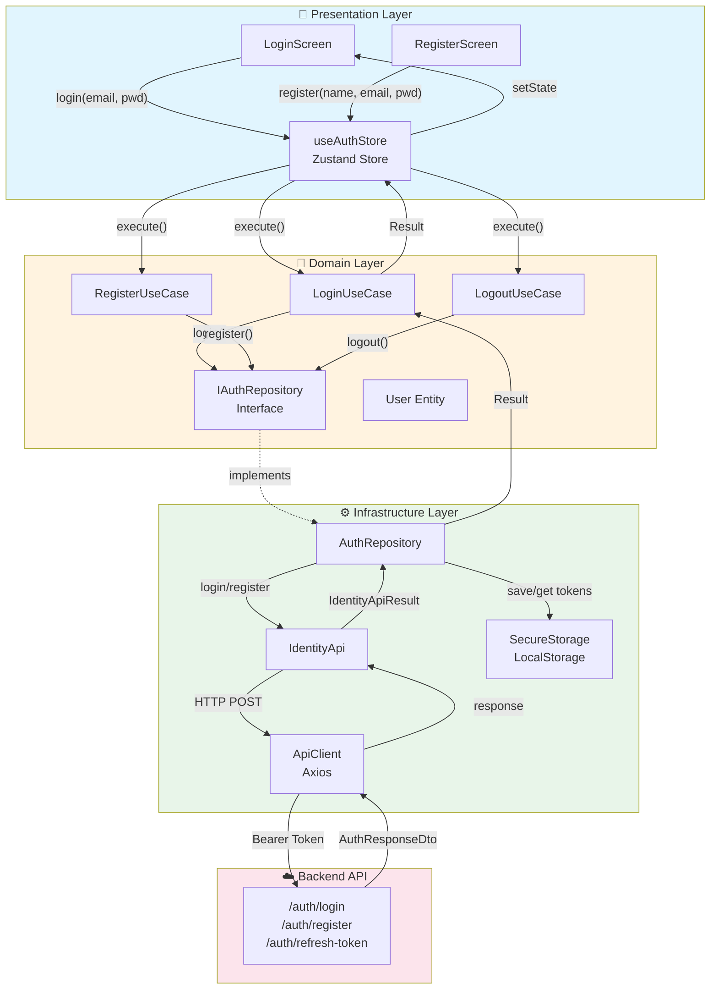
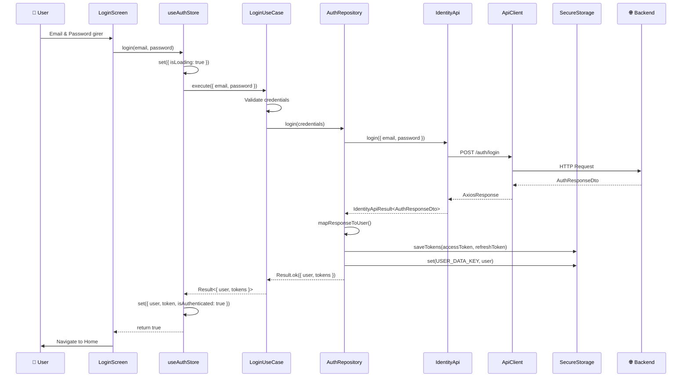
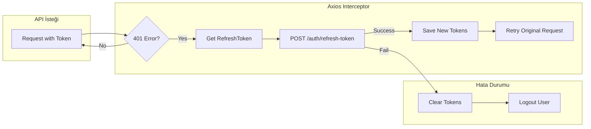

# 🔐 Auth Yapısı Akış Diyagramı

Bu belge, AI-Do Mobile uygulamasının kimlik doğrulama (authentication) yapısını açıklar.

## Mimari Genel Bakış



---

## Login Akışı (Sequence Diagram)



---

## Token Refresh Akışı



---

## Dosya Yapısı

| Katman | Dosya | Sorumluluk |
|--------|-------|------------|
| **Presentation** | [useAuthStore.ts](file:///c:/Users/ACER/Desktop/Projeler/ai-do-mobile/src/features/auth/presentation/stores/useAuthStore.ts) | UI state yönetimi (Zustand) |
| **Domain** | [Login.ts](file:///c:/Users/ACER/Desktop/Projeler/ai-do-mobile/src/features/auth/domain/usecases/Login.ts) | Login use case |
| **Domain** | [Register.ts](file:///c:/Users/ACER/Desktop/Projeler/ai-do-mobile/src/features/auth/domain/usecases/Register.ts) | Register use case |
| **Domain** | [Logout.ts](file:///c:/Users/ACER/Desktop/Projeler/ai-do-mobile/src/features/auth/domain/usecases/Logout.ts) | Logout use case |
| **Domain** | [IAuthRepository.ts](file:///c:/Users/ACER/Desktop/Projeler/ai-do-mobile/src/features/auth/domain/repositories/IAuthRepository.ts) | Repository interface |
| **Domain** | [User.ts](file:///c:/Users/ACER/Desktop/Projeler/ai-do-mobile/src/features/auth/domain/entities/User.ts) | User entity & value objects |
| **Infrastructure** | [AuthRepository.ts](file:///c:/Users/ACER/Desktop/Projeler/ai-do-mobile/src/features/auth/infrastructure/repositories/AuthRepository.ts) | Repository implementasyonu |
| **Infrastructure** | [identityApi.ts](file:///c:/Users/ACER/Desktop/Projeler/ai-do-mobile/src/features/auth/infrastructure/api/identityApi.ts) | Backend API çağrıları |
| **Infrastructure** | [apiClient.ts](file:///c:/Users/ACER/Desktop/Projeler/ai-do-mobile/src/core/infrastructure/api/apiClient.ts) | Axios instance + interceptors |
| **Infrastructure** | [SecureStorageAdapter.ts](file:///c:/Users/ACER/Desktop/Projeler/ai-do-mobile/src/core/infrastructure/storage/SecureStorageAdapter.ts) | Token saklama |

---

## Önemli Noktalar

### Clean Architecture
- **Domain katmanı** dış bağımlılıklardan tamamen izole
- **Dependency Inversion** prensibi: Repository interface üzerinden çalışıyor
- **Use Cases** iş mantığını kapsüller

### Güvenlik
- **JWT Token** tabanlı kimlik doğrulama
- **Secure Storage** kullanımı (mobile: expo-secure-store, web: localStorage)
- **Auto Token Refresh**: 401 hatası alındığında otomatik token yenileme

### Hata Yönetimi
- **Result Pattern**: `Result<T, Error>` ile fonksiyonel hata yönetimi
- **API Error Parsing**: Axios hataları için ayrıştırma mekanizması

---

## API Endpoints

| Method | Endpoint | Açıklama |
|--------|----------|----------|
| POST | `/auth/login` | Kullanıcı girişi |
| POST | `/auth/register` | Yeni kullanıcı kaydı |
| POST | `/auth/refresh-token` | Token yenileme |
| GET | `/auth/me` | Mevcut kullanıcı bilgisi |

---

## DTO Yapıları

### AuthResponseDto (Backend'den gelen)
```typescript
interface AuthResponseDto {
    user: UserDto;
    accessToken: string;
    refreshToken: string;
    expiresIn: number;
}
```

### LoginRequest (Backend'e gönderilen)
```typescript
interface LoginRequest {
    email: string;
    password: string;
}
```

### RegisterRequest (Backend'e gönderilen)
```typescript
interface RegisterRequest {
    name: string;
    email: string;
    password: string;
}
```
