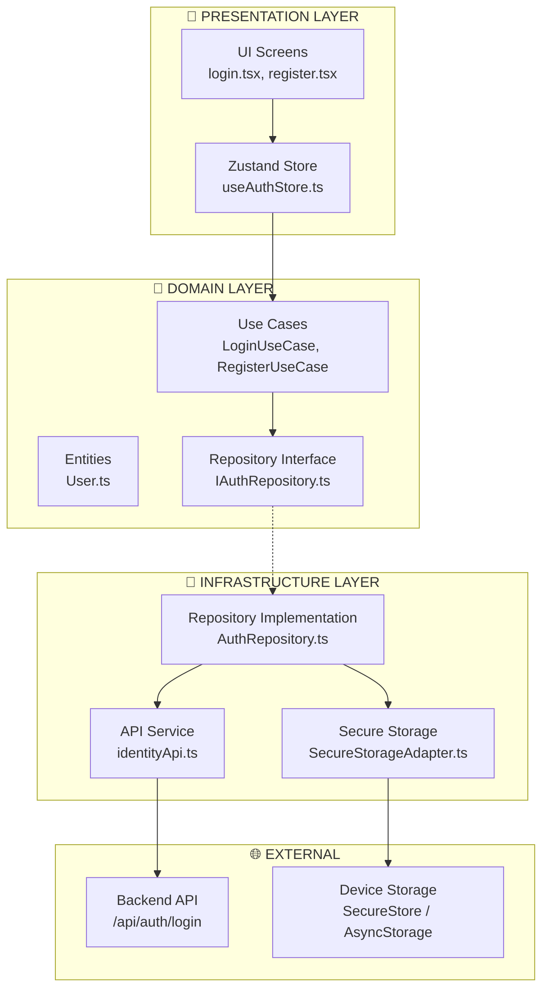
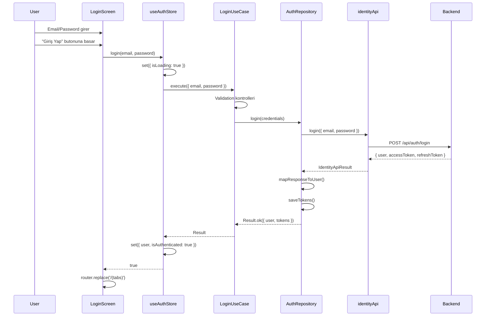
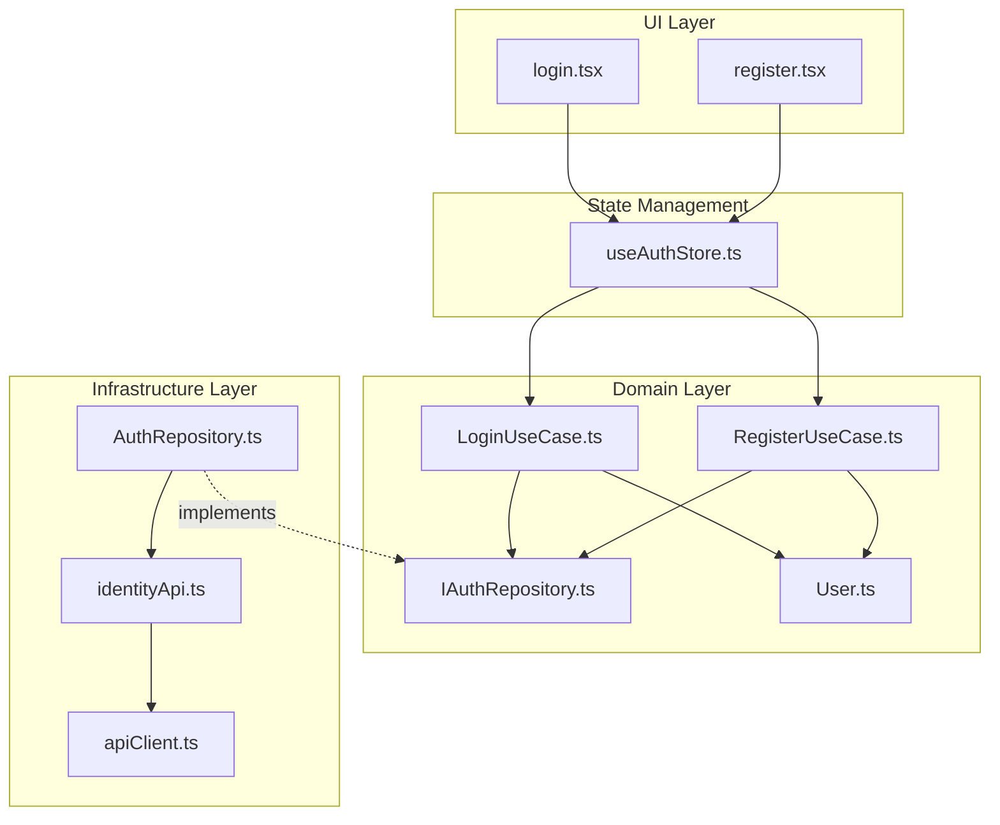

# AI-Do Mobile - Auth Modülü Mimari Dokümantasyonu

## Genel Bakış

Auth modülü, **Clean Architecture** ve **Feature-Based Organization** prensipleri kullanılarak tasarlanmıştır. Bu yaklaşım, kodun test edilebilirliğini, bakımını ve genişletilebilirliğini sağlar.

---

## Mimari Diyagram



---

## Katman Açıklamaları

### 1. Presentation Layer (Sunum Katmanı)

UI bileşenleri ve state yönetimi bu katmanda yer alır. Domain katmanına bağımlıdır.

#### Dosya Yapısı
```
app/
├── (auth)/
│   ├── _layout.tsx       # Auth group layout
│   ├── login.tsx         # Login ekranı
│   ├── register.tsx      # Kayıt ekranı
│   └── onboarding.tsx    # Onboarding ekranı

src/features/auth/presentation/
└── stores/
    └── useAuthStore.ts   # Zustand state store
```

#### UI Screen: login.tsx

```typescript
// Basit bir React bileşeni
export default function LoginScreen() {
    const router = useRouter();
    const { login, isLoading } = useAuthStore();  // Store'dan fonksiyon al
    
    const [email, setEmail] = useState('');
    const [password, setPassword] = useState('');
    
    const handleLogin = async () => {
        await login(email, password);  // Store action'ı çağır
        router.replace('/(tabs)');     // Başarılı ise ana ekrana git
    };
    
    return (
        <View>
            <Input value={email} onChangeText={setEmail} />
            <Input value={password} onChangeText={setPassword} />
            <Button onPress={handleLogin} loading={isLoading} />
        </View>
    );
}
```

#### State Store: useAuthStore.ts

```typescript
// Zustand store - Use Case'leri kullanır
const loginUseCase = new LoginUseCase(authRepository);
const registerUseCase = new RegisterUseCase(authRepository);

export const useAuthStore = create<AuthState>((set) => ({
    user: null,
    isAuthenticated: false,
    isLoading: false,
    
    login: async (email, password) => {
        set({ isLoading: true });
        
        const result = await loginUseCase.execute({ email, password });
        
        if (result.isSuccess) {
            set({
                user: result.value.user.toJSON(),
                isAuthenticated: true,
                isLoading: false,
            });
            return true;
        }
        
        set({ error: result.error.message, isLoading: false });
        return false;
    },
}));
```

---

### 2. Domain Layer (İş Mantığı Katmanı)

Bu katman **saf iş mantığı** içerir. Hiçbir harici bağımlılığı yoktur (React, Axios, vs.).

#### Dosya Yapısı
```
src/features/auth/domain/
├── entities/
│   └── User.ts             # User entity
├── repositories/
│   └── IAuthRepository.ts  # Repository interface (abstract)
└── usecases/
    ├── Login.ts            # Login use case
    ├── Register.ts         # Register use case
    ├── Logout.ts           # Logout use case
    └── index.ts            # Exports
```

#### Entity: User.ts

```typescript
// Domain Entity - Business logic içerir
export class User extends BaseEntity<UserProps> {
    private _email: string;
    private _name: string;
    
    // Factory method
    static create(email: string, name: string): User {
        return new User({
            id: new UniqueId().value,
            email,
            name,
            createdAt: new Date(),
            updatedAt: new Date(),
        });
    }
    
    // Business logic
    updateEmail(email: string): void {
        if (!email.includes('@')) {
            throw new Error('Invalid email format');
        }
        this._email = email.toLowerCase();
        this.touch();  // updatedAt güncelle
    }
    
    // Serialization
    toJSON(): UserProps {
        return {
            id: this._id,
            email: this._email,
            name: this._name,
            // ...
        };
    }
}
```

#### Repository Interface: IAuthRepository.ts

```typescript
// Soyut interface - implementasyon detayı YOK
export interface IAuthRepository {
    login(credentials: LoginCredentials): Promise<Result<{ user: User; tokens: AuthTokens }, Error>>;
    register(credentials: RegisterCredentials): Promise<Result<{ user: User; tokens: AuthTokens }, Error>>;
    logout(): Promise<Result<void, Error>>;
    getCurrentUser(): Promise<Result<User | null, Error>>;
    getStoredTokens(): Promise<Result<AuthTokens | null, Error>>;
}
```

#### Use Case: Login.ts

```typescript
// Use Case - Single Responsibility
export class LoginUseCase {
    constructor(private readonly authRepository: IAuthRepository) {}
    
    async execute(credentials: LoginCredentials): Promise<Result<{ user: User; tokens: AuthTokens }, Error>> {
        // 1. Validation (business rules)
        if (!credentials.email.trim()) {
            return Result.fail(new Error('Email is required'));
        }
        if (!credentials.password) {
            return Result.fail(new Error('Password is required'));
        }
        
        // 2. Repository çağrısı
        return await this.authRepository.login({
            email: credentials.email.toLowerCase().trim(),
            password: credentials.password,
        });
    }
}
```

---

### 3. Infrastructure Layer (Altyapı Katmanı)

Domain katmanındaki interface'lerin **somut implementasyonları** burada yer alır.

#### Dosya Yapısı
```
src/features/auth/infrastructure/
├── api/
│   ├── apiTypes.ts         # Backend DTO'ları
│   ├── identityApi.ts      # API service
│   └── index.ts
└── repositories/
    └── AuthRepository.ts   # IAuthRepository implementasyonu

src/core/infrastructure/
├── api/
│   └── apiClient.ts        # Axios HTTP client
├── config/
│   └── config.ts           # API URL konfigürasyonu
└── storage/
    └── SecureStorageAdapter.ts  # Storage abstraction
```

#### Repository Implementation: AuthRepository.ts

```typescript
// Interface'in somut implementasyonu
export class AuthRepository implements IAuthRepository {
    constructor(private readonly storage: IStorageAdapter = secureStorage) {}
    
    // Backend response'unu domain entity'ye çevir
    private mapResponseToUser(response: AuthResponseDto): User {
        return User.fromJSON({
            id: response.user.id,
            email: response.user.email,
            name: response.user.name,
            // ...
        });
    }
    
    async login(credentials: LoginCredentials) {
        // 1. API çağrısı
        const result = await identityApi.login({
            email: credentials.email,
            password: credentials.password,
        });
        
        if (!result.success) {
            return Result.fail(new Error(result.error?.message));
        }
        
        // 2. Response'u domain model'e dönüştür
        const user = this.mapResponseToUser(result.data);
        const tokens = {
            accessToken: result.data.accessToken,
            refreshToken: result.data.refreshToken,
        };
        
        // 3. Token'ları storage'a kaydet
        await this.saveTokens(tokens);
        await this.storage.set(USER_DATA_KEY, user.toJSON());
        
        return Result.ok({ user, tokens });
    }
}

// Singleton instance
export const authRepository = new AuthRepository();
```

#### API Service: identityApi.ts

```typescript
class IdentityApi {
    async login(request: LoginRequest): Promise<IdentityApiResult<AuthResponseDto>> {
        try {
            const response = await apiClient.post<AuthResponseDto>('/auth/login', request);
            return { success: true, data: response.data };
        } catch (error) {
            return { success: false, error: parseApiError(error) };
        }
    }
    
    async register(request: RegisterRequest): Promise<IdentityApiResult<AuthResponseDto>> {
        try {
            const response = await apiClient.post<AuthResponseDto>('/auth/register', request);
            return { success: true, data: response.data };
        } catch (error) {
            return { success: false, error: parseApiError(error) };
        }
    }
}

export const identityApi = new IdentityApi();
```

---

## Login Akışı (Data Flow)



---

## Dosya Bağımlılık Grafiği



---

## Result Pattern

Projede hata yönetimi için **Result Pattern** kullanılmaktadır:

```typescript
// core/domain/value-objects/Result.ts
export class Result<T, E> {
    private constructor(
        public readonly isSuccess: boolean,
        public readonly value: T,
        public readonly error: E,
    ) {}
    
    static ok<T>(value: T): Result<T, never> {
        return new Result(true, value, undefined as never);
    }
    
    static fail<E>(error: E): Result<never, E> {
        return new Result(false, undefined as never, error);
    }
}

// Kullanım
const result = await loginUseCase.execute(credentials);

if (result.isSuccess) {
    console.log(result.value.user);  // ✅ Type-safe user access
} else {
    console.error(result.error.message);  // ✅ Type-safe error access
}
```

---

## Navigation & Auth Guard

`_layout.tsx` dosyasında auth durumuna göre otomatik yönlendirme yapılır:

```typescript
function RootLayoutContent() {
    const { isAuthenticated, isOnboardingComplete, hydrateAuth } = useAuthStore();
    
    // App başladığında auth durumunu kontrol et
    useEffect(() => {
        hydrateAuth();  // Storage'dan token/user yükle
    }, []);
    
    // Auth durumuna göre yönlendir
    useEffect(() => {
        if (!isOnboardingComplete) {
            router.replace('/(auth)/onboarding');
        } else if (!isAuthenticated) {
            router.replace('/(auth)/login');
        } else {
            router.replace('/(tabs)');
        }
    }, [isAuthenticated, isOnboardingComplete]);
}
```

---

## Özet: Neden Bu Mimari?

| Özellik | Açıklama |
|---------|----------|
| **Separation of Concerns** | Her katman tek bir sorumluluğa sahip |
| **Dependency Inversion** | Domain katmanı, Infrastructure'a bağımlı DEĞİL |
| **Testability** | Use Case'ler mock repository ile test edilebilir |
| **Flexibility** | Backend değişirse sadece Infrastructure değişir |
| **Feature Isolation** | Auth, Task, Pomo özellikleri birbirinden bağımsız |

---

## Hızlı Referans

| Dosya | Sorumluluk |
|-------|------------|
| `login.tsx` | UI bileşenleri, form state |
| `useAuthStore.ts` | Global auth state, actions |
| `LoginUseCase.ts` | Validation, business rules |
| `IAuthRepository.ts` | Soyut repository arayüzü |
| `AuthRepository.ts` | API + Storage işlemleri |
| `identityApi.ts` | HTTP istekleri |
| `User.ts` | User domain entity |
